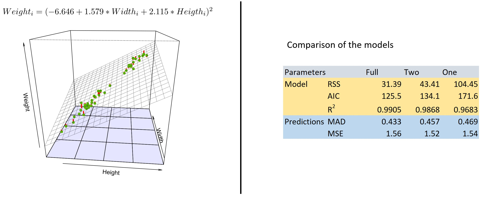

```{r setup, include=FALSE}
options(tinytex.verbose = TRUE)
knitr::opts_chunk$set(echo = TRUE)
knitr::opts_chunk$set(warning = F)
knitr::opts_chunk$set(message  = F)
knitr::opts_chunk$set(fig.align = "center")
```
###  Short Theory Recap: Multiple Linear Regression (MLR)
The model equation for MLR has the form  $Y=X\Theta$ +$\epsilon$ ,with $Y$ being the target vector, $X$ the explanatory matrix, $\Theta$ the parameter vector and the error vector $\epsilon$. We assume that the residuals are normally distributed  $\epsilon$ ~  $N(0,\sigma^{2})$. The estimation of $\Theta$ is done with the maxium likelihood method  $L(\theta)=P(X|\theta)=\frac{1}{\sqrt(2\pi)\sigma}*e^{-\frac{1}{2\sigma^{2}}*||y-\theta X||^{2}}$ by solving the equation $\Theta=(X^{T}X)^{-1}X^{T}y$  *(1)*.

###  Dataset
We use the fish market dataset from a past Kaggle competition. It describes the characteristics of seven fish species. Figure \ref{fig:pairwise} is a pairwise plot and provides us with an overview. This plot as well as the dataset is further described in the next chapter. 

```{r, include=F,echo=T}
library(GGally)
library(readr)
library(ggplot2)
library("ggpubr")

fish_dat=read_csv("Fish.csv")
```


```{r pairwise, fig.align='center', out.width='90%', fig.cap="Pairwise plot of the fish dataset. The different species are shown in different colors.", echo=FALSE}

```

\newpage


###  Data Exploration

Further information of the dataset is gained with the following commands. For space restrictions, various codes and outputs are omitted from this work. Full code and project can be found on https://github.com/buehlpa/TSM_MarkFor.

```{r , include=T,eval=  F}
fish_dat=readr::read_csv("Fish.csv")                        #  reading as tibble
GGally::ggpairs(fish_dat,aes(color = Species)) + theme_bw() #  pairwise plot 
summary(fish_dat);str(fish_dat);View(fish_dat)              #  statistics and structure
``` 

The pairwise plot in figure \ref{fig:pairwise} provides a visual overview of the dataset. It consists of 159 observations measured for 6 numerical variables which measure properties of the fish and one categorical variable to describe the species. The coloring in the pairwise plot allows a distinction of the species. From the top leftmost plot, it can be seen that the Perch species has the most observations. 

From the pairwise scatter plots  a nonlinear relation between weight and the other numerical variables is observed, therefore the correlation *cannot* be correctly interpreted with these variable pairs. Further, the other numerical variables are linearly correlated (the correlation statistic can be interpreted), interestingly the 3 length measurements have a very strong correlation to each other. The length of the fish is measured in different ways, which is why there are three different $Length1$ (vertical length), $Length2$ (diagonal length) and $Length3$ (cross length).

The density plots in the diagonal help to see how the variables are distributed. For example, the width of Smelt tends to have a bimodal distribution. This must be taken with a grain of salt due to the sparse data, which can be seen on the inverted histograms on the left. Also, the pairwise boxplots give a good overview for comparison between the different variables. For example, it can be seen that the variance of the species varies among the levels.

The distribution of the target variables is actually very important since MLR assumes multivariate normality of the data. For the modelling of different  distributions, we might choose another model such as a Generalized-Linear-Model to improve the model validity. In this paper, we explore the use of MLR.

```{r, include=F,echo=T}
Perch_dat=fish_dat%>%dplyr::filter(Species=="Perch") # Use only Perch 
```


###  Building a Model

To evaluate the accuracy of the model created in this chapter, the data is split into a train and test set, using Simple Random Sampling without Replacement ($SRSWR$). 80% of the data is used for training and the remaining 20% is for testing the prediction accuracy. The corresponding R code is given below:

```{r , include=T,eval=  T}
set.seed(42);samp= sample(1:56,size = 11,replace = F)       # Seed & sample size 80%
Perch_train=Perch_dat[-samp,];Perch_test=Perch_dat[samp,] # train / test sample
```

The dataset provides many different options to do linear regression. Nevertheless, for MLR there is a problem with multicollinearity since a lot of the variables are strongly correlated. This means that if multiple independent variables are in the model, it would not be clear which one explains the effect the best for the target variable.

Therefore, the first thing we do is fitting a simple linear regression model. We use the weight of a fish as the response variable. The explanatory variable width is used, since this is intuitively a good indicator for the weight of a fish from our "fishing experience". In a next step, we check whether a MLR model can represent the data even better.

Finally, the models are compared quantitatively with the residual sum of squares ($RSS$), R-squared and the Akaike information criterion ($AIC$). Subsequently, the models will be used with the test set for predictions, whose performance will be measured with the Mean Absolute Deviation ($MAD$) and the Mean Squared Error ($MSE$). The reason why we not only use the $MSE$ is because of the small test set, one far point could massively influence the statistic due to the square.

###  Simple Linear Regression (SLR)

For the sake of simplicity, we focus on the species Perch (Swiss-German: Egli) since we have the most data. Since the weight has a linear relation to the other variables, we try to transform it properly.


```{r transformation, include=T,echo=  F,fig.dim=c(8,2) , fig.cap="Transformations of the variable weight for Perch"}
                          #  Use only Perch data
nPlt=ggplot(Perch_train,aes(Width,Weight))+geom_point(color="#5BB300")+ theme_bw()

#  plot 
logPlt=ggplot(Perch_train,aes(Width,log(Weight)))+geom_point(color="#5BB300")  + theme_bw()                  
sqrtPlt=ggplot(Perch_train,aes(Width,sqrt(Weight)))+geom_point(color="#5BB300")+ theme_bw()
ggpubr::ggarrange(nPlt, logPlt, sqrtPlt,labels = c("   Default", "Logarithm", "Square root"),ncol = 3, nrow = 1)
```

Figure \ref{fig:transformation} shows the scatter plot of the original data in comparison to the two transformed ones (logarithm and squared). If we transform the weight with the logarithm, it looks a bit better but still is not completely linear. The square root transformation looks better, the data seems much more linearly dependent. One can observe that the variance towards the right side of the model increases even after the transformations.

&nbsp;

We choose the square root transformation and create the simple linear regression model:

```{r , include=T,eval=  T,echo=T}
Perch_fit=lm(sqrt(Weight)~Width,data = Perch_train) #  Simple linear regression model
``` 

```{r lm_perch, include=T,echo=  F,fig.dim=c(6,1.8), fig.cap="Simple linear regression model for Species Perch weigth vs width"}
Perch_train$Weight_sqrt=sqrt(Perch_train$Weight)
ggplot(Perch_train,aes(Width,Weight_sqrt)) +
  geom_point(color="#5BB300") +
  geom_smooth(method='lm',color="black",fill="red") + theme_bw()
```

From the summary output we get the following model $Weight_{i}=(-6.000 + 4.9368 * Width_{i})^{2}$. The explained variance measurement $R^{2}$ is very high with a value of $0.9683$. The $AIC$ for this model is $171.6$. The p-values for the both parameters hypothesis tests are also significant. By inspecting the residuals in figure \ref{fig:resid_perch}, we can check the model assumptions [2]. The residuals seem to follow a normal distribution, have constant mean and there are no points which are crucial to shift the model. Nevertheless, the variance is not constant and increases towards the right side. 

```{r resid_perch,out.width='100%',fig.dim=c(5,3), fig.cap="Analysis of residuals for the SLR. The expected value remains stable (Tukey-Anscombe), but the variance increases with time (scale location). The distribution is not perfect, but can be passed (Normal Q-Q). There are some outliers, but the values for the explanatory variables are within the range. According to Cook's Distance, they are not yet dangerously influential.", echo=FALSE}

```

\newpage

###  Multiple Linear Regression and the Problem of Multicollinearity

We check if the addition of more variables is more beneficial for the model.

```{r ,echo=T, include=F,eval=T}
Perch_fit_full=lm(sqrt(Weight)~.,data = Perch_dat[,-1])                #  MLR
```

```{r ,echo=T, include=T,eval=F}
Perch_fit_full=lm(sqrt(Weight)~.,data = Perch_dat[,-1])                #  MLR
car::vif(Perch_fit_full);drop1(Perch_fit_full);summary(Perch_fit_full) #  VIF, drop1, output
```

```{r MLR_output,out.width='100%',fig.dim=c(5,3), fig.cap="VIF, MLR Output and Drop1 Global F-test, for the Full Model", echo=FALSE}
knitr::include_graphics("MLR_output.jpg")
```

The $VIF$ helps us to identify multicollinearity and indicates that the variables have a very high collinearity as expected. Especially the three variables of the lengths result in massively higher $VIF$ values than for the other variables. The problem is also visible in the summary output in figure \ref{fig:MLR_output}. The variables $Length1$, $Length2$ and $Length3$ are not significant although they are highly correlated with the target. This is because the collinearity inflates the standard error which leads to insignificant t-statistics *[1]*.

According to that research paper we cannot reliably interpret these statistics. Further, if there were a full correlation between two variables meaning that $X_{1}$ would be a linear combination of $X_{2}$, the covariance $\frac{1}{n}X^{T}X$ would not have an inverse and *(1)* cannot be solved, although in the computer the estimation is done by minimizing the $RSS(\theta)$ and therefore we get results. With $PCA$*[3]* we could check which of the variables explain the most variance and then remove the "unimportant" ones. Due to the task limitation, we just keep this consideration in mind and simply remove the Length variables and fit a model with two explanatory variables for a final comparison.

```{r ,echo=T, include=T,eval=F}
Perch_fit_two=lm(sqrt(Weight)~Width+Height,data = Perch_dat[,-1])       
summary(Perch_fit_two)#  MLR
```

The regression model, which is now a 2 dimensional hyperplane is visualized in Figure \ref{fig:lm_two_output} (left side). 

```{r lm_two_output,out.width='80%',fig.dim=c(5,3), fig.cap="Left: Visualization 3d, Right: Results from the model comparison", echo=FALSE}

```


```{r ,echo=F, include=T,eval=T}
Perch_fit_two=lm(sqrt(Weight)~Width+Height,data=Perch_dat[,-1])       
```


### Results 

The quantitative comparison of the different models are shown in the right table in figure \ref{fig:lm_two_output}. We distinct these metrics between the model itself (how well it fits the data) and the accuracy of the predictions using the test sample. The  $RSS$ is the best for the full model, that was to expect since a model with more parameters always leads to smaller scores. AIC considers the trade-off between model goodness of fit and model simplicity when assessing the amount of information lost by a model. To put it another way, AIC considers both the risks of overfitting and underfitting. The $AIC$ is also better (smaller) for the bigger model. The $R^{2}$ is relatively high with >96% for all three models. The largest model describes almost the entire variance with a $R^{2}$ of 99.05%.

Next we compare the predictions. The average of the absolute errors is known as $MAD$. The $MSE$ is the average of the squared errors. $MSE$ is more sensitive to big errors since the errors are squared. $MSE$ and $MAD$ look quite the same for all of the three models. Therefore, the models are equally useful for forecasting. 


### Conclusion

Einstein once said quote: *“Make everything as simple as possible, but not simpler”*. 
This is wonderfully consistent with modelling, we can see that the SLR leads to good predictions and we do not need to go to higher dimensions if a relation can be explained very well with two variables. In this paper, we applied a limited number of variable selection methods. These could be complemented with methods like stepwise selection (forward and backward) or the Bayesian Information Criterion (BIC). In contrast to the AIC, the BIC penalizes more complex models more, so that they reach a higher value. Of course, one would have to make sure that the data set used for this is sufficiently large and representative. Finally, based on our experience in this work, we suggest that trial-and-error is necessary in real-world applications in order to find the optimal model. Finally, a model must also be evaluated from an expert point of view, since, as is well known, correlation does not equal causality. 

\newpage

## Appendix
This work is generated in R-Studio 2021.09.0 with R-4.1 with Rmarkdown. Full project and the used code components can be found on the GitHub repository (https://github.com/buehlpa/TSM_MarkFor). This is a graded assignment for the module Market Analysis and Forecasting (TSM_MarkFor) of the Master of Science in Engineering program (MSE) at Zurich University of Applied Science.

### Dataset

The dataset is from a past Kaggle competition (https://www.kaggle.com/aungpyaeap/fish-market) and can be found in the CSV file "Fish.csv" in the GitHub repository. 

### Literature

*[1] Multicollinearity and Regression Analysis, December 2017, Journal of Physics Conference Series 949(1):012009, Jamal Daoud, https://www.researchgate.net/publication/322212939_Multicollinearity_and_Regression_Analysis*

*[2] Linear Regression and its assumptions, January 24,2020, Manish Sharma, https://towardsdatascience.com/linear-regression-and-its-assumptions-ef6e8db4904d*

*[3] Principal Component Analysis, January 2017, International Journal of Livestock Research, Sidharth Mishra et. al, https://www.researchgate.net/publication/316652806_Principal_Component_Analysis*
