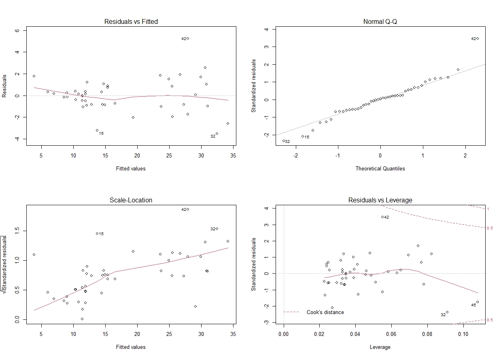

```{r setup, include=FALSE}
options(tinytex.verbose = TRUE)
knitr::opts_chunk$set(echo = TRUE)
knitr::opts_chunk$set(warning = F)
knitr::opts_chunk$set(message  = F)
knitr::opts_chunk$set(fig.align = "center")
```
###  Short Theory Recap Multiple Linear Regression (MLR)
The model equation for MLR has the form  $y=X\Theta$ +$\epsilon$ ,with $y$ being the target vector, $X$ the explanatory Matrix,$\Theta$ the parameter vector and the residuals with the assumption that they are normally distributed  $\epsilon$ ~  $N(0,\sigma^{2})$. The estimation of $\Theta$ is done with the Maxium likelihood  $L(\theta)=P(X|\theta)=\frac{1}{\sqrt(2\pi)\sigma}*e^{-\frac{1}{2\sigma^{2}}*||y-\theta X||^{2}}$ by solving the equation $\Theta=(X^{T}X)^{-1}X^{T}y$.

###  Dataset
The data from 7 common fish species for fishmarket is provided from Kaggle.
https://www.kaggle.com/aungpyaeap/fish-market

```{r, include=F,echo=T}
library(GGally)
library(readr)
library(ggplot2)
library("ggpubr")

fish_dat=read_csv("Fish.csv")
```


```{r pairwise, fig.align='center', out.width='95%', fig.cap="pairwise plot of the fish dataset", echo=FALSE}
knitr::include_graphics("fish_pairs.jpeg")
```
###  Data exploration

Information of the Dataset is gained with the following commands. *Note: the output is not shown to reduce space in the document full code and generation pf document can be found on https://github.com/buehlpa/TSM_MarkFor*
```{r , include=T,eval=  F}
fish_dat=readr::read_csv("Fish.csv")                        #  reading as tibble
GGally::ggpairs(fish_dat,aes(color = Species)) + theme_bw() #  pairwise plot 
summary(fish_dat);str(fish_dat)                             #  statistics and structure
``` 

The pairwise plot Figure \ref{fig:pairwise} provides a visual overview of the dataset. It consists of 159 observations measured for 6 numerical variables which measure properties of the fish and one categorical variable to describe the Species. The coloring in the pairwise plot allows a distinction of the Species, one can immediately observe that the species Perch has the most observations.

From the pairwise scatterplots  a nonlinear relation between weight and the other numerical variables is observed, therefore the correlation *cannot* be correctly interpreted with these variablepairs.
Further the other numerical variables are linearly correlated (the correlation statistic can be interpreted), interestingly the 3 length measurements have a very strong correlation to each other.

The density plots helps see how the variables themselves are distributed. For example the width of Smelt tends to have a bidmodal distribution, altough this has to be taken with a grain of salt due to the sparse data, see on the inverted histograms on the left. 
Also the pairwise boxplots gives a good overview for comparison between the different variables. For example it can be seen that the variance of the species vary amongst the levels.

The distribution of the target variables is actually very important since MLR assumes multivariate normality of the data, for other distributions we might choose another model such as a Generalized-Linear-Model to improve the model validity, but for this analysis we stick to MLR.


###  Building a Model

The dataset provides many different options to do linear regression, nevertheless for MLR there is a problem with multicollinearity since a lot of the variables are strongly correlated, meaning that if multiple independent variables would be in the model it wouldn't be clear which one explains the effect the best for the target variable.

For a first approach we could just focus on the species Perch (in swiss-german it's called Egli) since we have the most data there. Lets find a Model for Predicting the weight of this particular species with the variables width height and length. Since  the weight hasn't got a linear relation to the other variables, we'll transform it properly.


```{r transformation, include=T,echo=  F,fig.dim=c(8,2) , fig.cap="transformations of weight for Perch"}
Perch_dat=fish_dat%>%dplyr::filter(Species=="Perch")                           #  Use only Perch data
nPlt=ggplot(Perch_dat,aes(Width,Weight))+geom_point(color="#00B81F")+ theme_bw()

#  plot 
logPlt=ggplot(Perch_dat,aes(Width,log(Weight)))+geom_point(color="#00B81F")  + theme_bw()                  
sqrtPlt=ggplot(Perch_dat,aes(Width,sqrt(Weight)))+geom_point(color="#00B81F")+ theme_bw()
ggpubr::ggarrange(nPlt, logPlt, sqrtPlt,labels = c("   Default", "Logarithm", "Square root"),ncol = 3, nrow = 1)
```
If we transform the weight with the logarithm it looks a bit better but still isn't linear see Figure \ref{fig:transformation}. The squareroot transformation seems to be the right one. Now the data seems much more linearly dependent. Therefore a first model can be set up
```{r , include=T,eval=  T,echo=T}
Perch_fit=lm(sqrt(Weight)~Width,data = Perch_dat) #  Simple linear regression model
``` 

```{r lm_perch, include=T,echo=  F,fig.dim=c(6,2), fig.cap="linear regression model for Perch weigth vs width"}
Perch_dat$Weight_sqrt=sqrt(Perch_dat$Weight)
ggplot(Perch_dat,aes(Width,Weight_sqrt)) +
  geom_point(color="#00B81F") +
  geom_smooth(method='lm',color="black") + theme_bw()
```
From the summary output we get the following model $Weight_{i}=(-5.5245 + 4.8571 * Width_{i})^{2}$. The explained Variance measurement $R^{2}$ is with $0.9719$ very high. the $AIC$ for this model is $206.76$. The p-values for the both parameters are also significant. By inspecting the residuals in Figure \ref{fig:resid_perch} we can see that the model assumptions are met. The residuals seem to follow a normal distribution, have constant variance, constant mean and there are no points which are crucial to shift the model.

```{r resid_perch,out.width='80%',fig.dim=c(5,3), fig.cap="Residuals for the Perchfit", echo=FALSE}

```


```{r , include=T,echo=F,eval=  F}
summary(Perch_fit)
AIC(Perch_fit)

```


&nbsp;

The way we have chosen is starting with a sparse model. Lets make now a full model and test if a larger model is more beneficial. The multicollinearity is checked with Variance Inflation Factor and a F test checks the importance of the variables


```{r , include=T,eval=  T,echo=T}
Perch_fit_full=lm(sqrt(Weight)~.,data = Perch_dat[,-1]) #  Multiple linear regression model
summary(Perch_fit_full)
car::vif(Perch_fit_full)
drop1(Perch_fit_full)
``` 

The VIF helps us to identify multicollinearity and indicates that the variables have a very high collinearity as expected. Especially the three variables of the lengths result in massively higher VIF values than for the other variables. 


